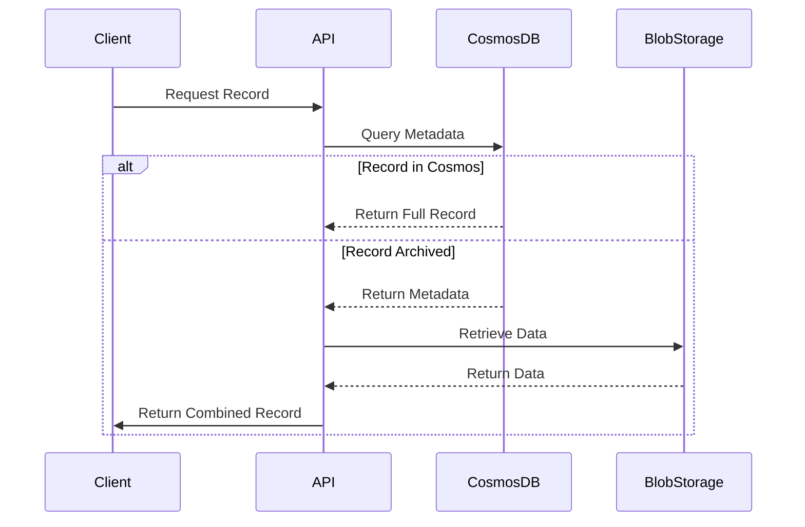

# Solution Architecture

## Overview
This solution implements a cost-optimized tiered storage architecture for Azure Cosmos DB billing records.

## Components

### 1. Azure Cosmos DB (Hot Tier)
- Stores metadata for all records
- Contains full data for recent records (<3 months)
- Serverless capacity mode for cost efficiency

### 2. Azure Blob Storage (Cold Tier)
- Stores archived records (≥3 months)
- Cool access tier for cost savings
- Compressed JSON format

### 3. Azure Functions
- **ArchiveFunction**: Timer-triggered archival process
- **RetrieveFunction**: HTTP-triggered retrieval endpoint

## Data Flow

